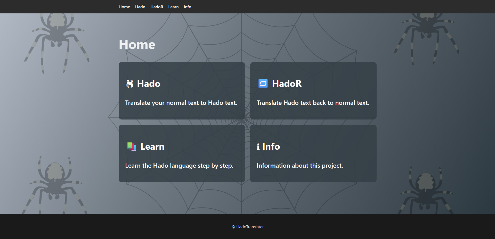

# 🕷️ WebSpider – Hado Translator 🕸️

---

### Brief explanation

In my WebSpider project, I am creating a **web-based translator** for my own language called **Hado** (not a programming language).

The goal of this project is to build a modern **full-stack web application** where users can translate text between their own language and Hado.

While working on this project, I am exploring and learning new technologies such as **Java (Java 25)**, **Spring Boot**, **React**, and **MariaDB**.  
Because I am still learning, this project helps me experiment with new concepts and technologies that I have not worked with before.

## 🛠 Technologies Used

| Java | Spring Boot | React | Maven | MariaDB |
|-----|-----|-----|-----|-----|
|  |  |  |  |  |

---

#### Home screen

On the home screen there are sort of small
explanations of what each screen does (besides the home, login screens).

---

### what I'm still working on

- Small bugs
- more screens

---

### ideas that are coming

- User ID and password security

---
---

### link to app variant
https://github.com/Outlaw23/Translator

